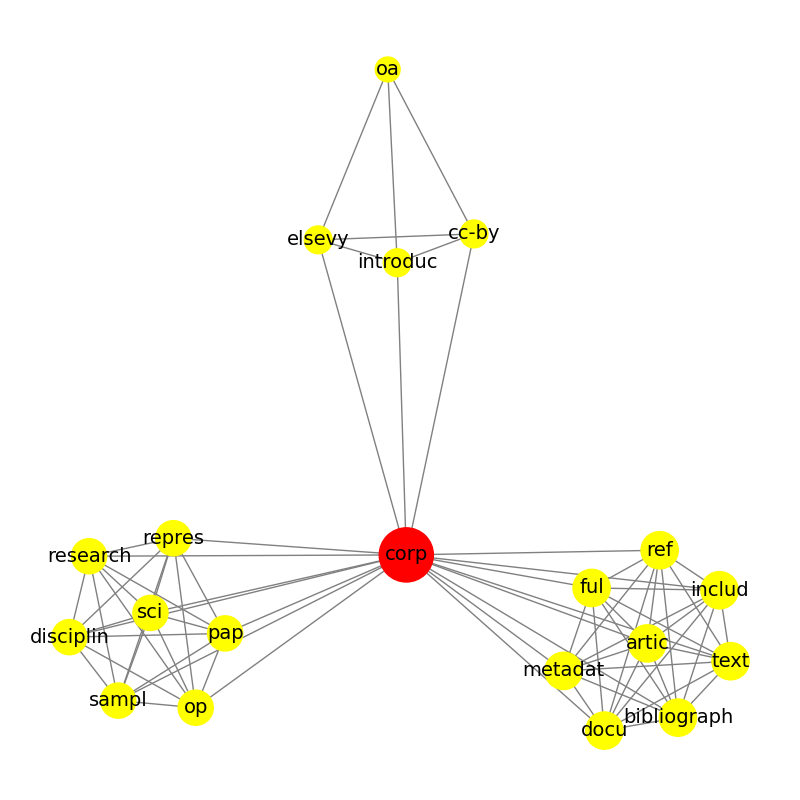

# Approximated Centralities for Keyword Extraction 


## Contents

* [Authors](#authors)
* [Goals](#goals)
* [Repository Structure](#Repository)
* [Requirements](#Requirements)
* [Some Usage Examples](#Some Usage Examples)
* [Results](#results)
* [Acknowledgements](#acknowledgements)

## Authors

* **Salvalaio Matteo** - MSc Computer Engineering Student at UniPD
* **Segala Andrea** - MSc Computer Engineering Student at UniPD
* **Tognon Mariafiore** - MSc Computer Engineering Student at UniPD

## Goals


The goal of this project is to assess whether approximated centralities applied to co-occurrence networks can aid the task of keyword extraction, ranking the words from a text according to their relevance.
## Repository Structure

```
lfn-ke/
├── commons/
│   ├── graph.py
│   ├── parse.py
│   └── scores.py
├── experiments/
├── images/
├── resources/
│   ├── allowed_files.txt
│   └── longStopword.txt
├── experiment_runner.ipynb
├── README.md
└── requirements.txt
```

The ```commons``` folder constitutes our library:
- ```graph.py``` contains utilities to build and display graphs, and some of the approximate centrality algorithms
- ```parse.py``` contains utilities to parse the dataset
- ```scores.py``` contains utilities for Precision and Recall scores, saving run results and hypothesis testing

The run results are stored in the ```experiments``` folder, where each subfolder is a named run.
Each run is composed by ```.csv``` files which are the results in terms of Precision and Recall for a specified centrality.

The ```resources``` folder store the stopwords list and the allowed files (i.e., JSON article files with all the required fields and whose graphs are large enough).

```experiment_runner.ipynb``` is the file from which you can run the project: this file samples articles, computes centralities, saves the runs and shows the results.

## Requirements
The project makes use of the following libraries:

* [NLTK](https://www.nltk.org/) for text preprocessing
* [NetworkX](https://networkx.org/) for graph analysis and creation
* [Pandas](https://pandas.pydata.org/) and [Seaborn](https://seaborn.pydata.org/) for result analytics

Further informations can be found in the [requirements.txt](requirements.txt) file.
> [!WARNING]
> Some versions of scipy and networkX may clash. Possible solutions are reported [here](https://github.com/pyg-team/pytorch_geometric/issues/4378)

To install the necessary libraries, it is possible to run the command:
```sh
pip install -r requirements.txt
```
#  Some Usage Examples

### Creating and visualizing a co-occurrence network
Initialize a graph maker object to encapsulate a stemmer and a stopwords list:
```sh
text = 'NetworkX is a Python package for the creation, manipulation, and study of the structure, dynamics, and functions of complex networks. With NetworkX you can load and store networks in standard and nonstandard data formats, generate many types of random and classic networks.'

gm = commons.graph.GraphMaker('resources/longStopwords.txt', 'LAN')
```
Build the graph for your text:
```s
word_graph = gm.buildGraph(text)
```
Display a co-occurrence graph:
```s
commons.graph.printGraph(word_graph)
```

Here is the result!


### Experiment Runner Notebook

The notebook allows you to sample articles from the "Elsevier OA CC-By Corpus" (which can be found [here](https://elsevier.digitalcommonsdata.com/datasets/zm33cdndxs/2)) and to compute centrality metrics on the resulting co-occurrence graphs. It is also possible to visualize performance metrics with boxplots and Tukey HSD test.

## Results
Among the various applied centralities the Local Clustering Coefficient seem to provide the best Precision. However, we are aware that our model of the co-occurrence graph has some limitations.
For full results and discussion refer to the Project Report.

## Acknowledgements
This project was developed as part of the [**Learning from Networks**](https://www.didattica.unipd.it/off/2021/LM/IN/IN2547/003PD/INQ0091104/N0) course held by professor Fabio Vandin in Academic Year 2023/2024.


[//]: # (These are reference links used in the body of this note and get stripped out when the markdown processor does its job. There is no need to format nicely because it shouldn't be seen. Thanks SO - http://stackoverflow.com/questions/4823468/store-comments-in-markdown-syntax)

   [dill]: <https://github.com/joemccann/dillinger>